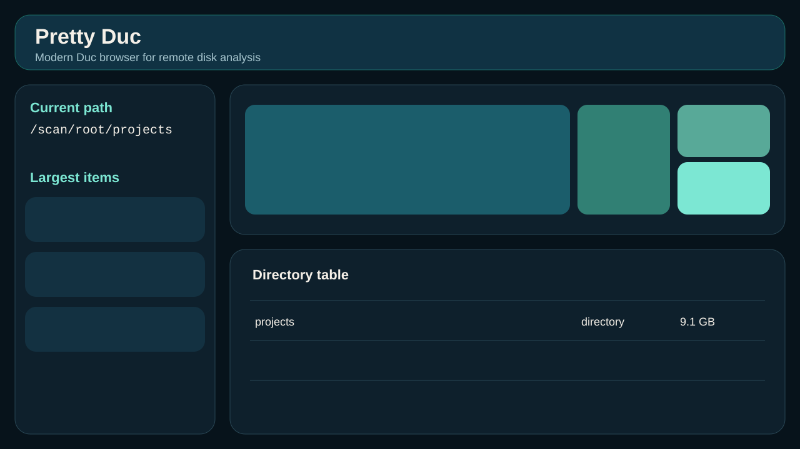

# Pretty Duc

Pretty Duc is a modern web UI and JSON API for browsing [Duc](https://github.com/zevv/duc) disk usage data. It runs as a separate Docker service, reads a shared Duc database volume, and uses the `duc` CLI as its only integration layer.



## Features

- Fastify API for health, database info, directory children, and guarded tree expansion
- React + Mantine explorer UI with breadcrumb navigation, drill-down, treemap, and sunburst views
- Search/filter, dark mode, copy path, refresh, largest items panel, and keyboard navigation
- Docker deployment alongside a separate Duc scanner service
- Integration tests designed to run in Docker containers

## Stack

- Backend: Node.js + TypeScript + Fastify
- Frontend: React + Vite + TypeScript
- UI: Mantine
- Visualization: Apache ECharts
- Tooling: bun
- Container runtime: Docker

## Environment variables

| Variable | Default | Purpose |
| --- | --- | --- |
| `DUC_DATABASE` | `/database/duc.db` | Path to Duc DB |
| `DUC_ROOT` | `/scan/root` | Root path exposed by Pretty Duc |
| `PORT` | `3000` | HTTP server port |
| `DUC_BIN` | `duc` | Duc executable path |
| `DEFAULT_MIN_SIZE` | unset | Optional minimum size filter in bytes |

## Local development

```bash
bun install
bun run build
bun run test
```

Run the API and web app separately during development:

```bash
bun run dev:api
bun run dev:web
```

- API: `http://localhost:3000`
- Web: `http://localhost:5173`

The Vite dev server proxies `/api` to the API server.

## Docker usage

Use the example stack in `docker/compose.example.yml`:

```bash
docker compose -f docker/compose.example.yml up --build
```

This starts:

- `duc`: a separate scanner container writing `/database/duc.db`
- `pretty-duc`: the UI/API service mounting the Duc database read-only

Pretty Duc does not need host filesystem access. Only the scanner service reads the host scan root.

## Integration test stack

Run containerized integration tests with:

```bash
bun run test:integration
```

On Windows, this command forwards into WSL so Docker uses the Linux daemon there. On WSL/Linux, it runs Compose directly.

Manual WSL/Linux form:

```bash
docker compose -f docker/compose.integration.yml up --build --abort-on-container-exit --exit-code-from test
```

The integration stack:

- scans `tests/fixtures/fs` into a shared Duc database volume
- starts Pretty Duc against that volume
- runs black-box tests from a dedicated test container

## API

### `GET /api/health`

Returns service and database status.

```json
{
  "ok": true,
  "ducAvailable": true,
  "databaseReadable": true,
  "database": "/database/duc.db",
  "root": "/scan/root"
}
```

### `GET /api/info`

Runs `duc info -d /database/duc.db` and returns raw output plus best-effort parsed metadata.

### `GET /api/children?path=/scan/root&levels=2&sort=sizeDesc`

Lists immediate children or recursively expands to the requested depth using repeated `duc ls` calls.

Example child shape:

```json
{
  "name": "var",
  "path": "/scan/root/var",
  "sizeBytes": 12884901888,
  "humanSize": "12.0 GB",
  "type": "directory",
  "percentOfParent": 42.7,
  "hasChildren": true
}
```

### `GET /api/tree?path=/scan/root/var&levels=2`

Returns a bounded subtree for explicit paths. This implementation uses guarded repeated `duc ls` calls instead of `duc json` for consistency and safer payload control.

## Safety notes

- Paths are canonicalized and must stay at or below `DUC_ROOT`
- Arbitrary Duc arguments are never accepted from clients
- Duc commands are executed without shell interpolation
- Timeouts, node caps, and payload caps protect the backend from oversized requests
- Reverse proxy or basic auth is recommended for internet-facing deployments

### Reverse proxy/basic auth example

Terminate TLS and enforce auth in front of Pretty Duc with Nginx, Caddy, or Traefik. A minimal Nginx pattern:

- proxy `/:` to `pretty-duc:3000`
- add HTTP basic auth with `auth_basic`
- restrict access by IP or VPN where possible

## Limits and defaults

- Duc timeout per command: `5000ms`
- Recursive request budget: `15000ms`
- `/api/children` max levels: `4`
- `/api/tree` max levels: `2`
- Max children per directory: `500`
- Max recursive nodes for `/api/children`: `2000`
- Max nodes for `/api/tree`: `200`

## Notes on Duc integration

- Normal browsing uses `duc ls -b -d <db> -F <path>`
- Pretty Duc does not parse the Duc database directly
- Pretty Duc avoids `duc json` for large roots and routine navigation

## Screenshots

- Overview: `docs/screenshots/overview.svg`

## Testing

Unit and UI tests:

```bash
bun run test
```

Container integration tests:

```bash
bun run test:integration
```

Manual WSL/Linux form:

```bash
docker compose -f docker/compose.integration.yml up --build --abort-on-container-exit --exit-code-from test
```
