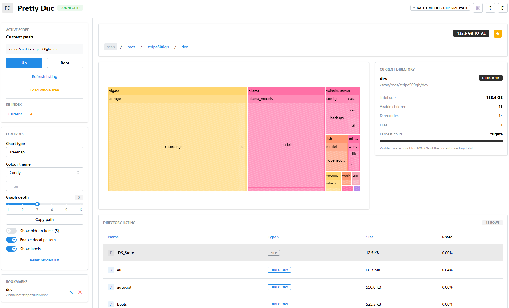
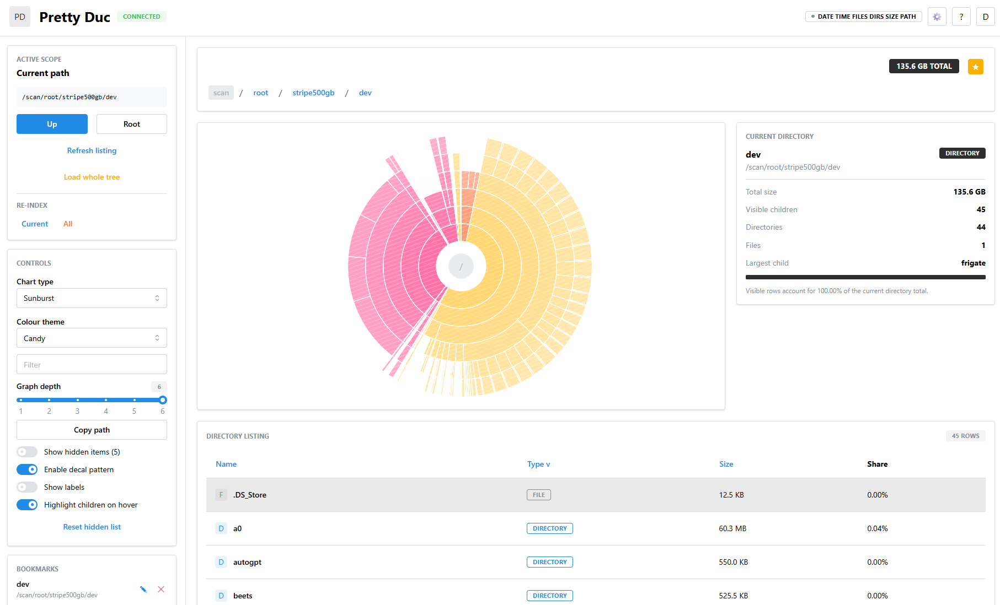
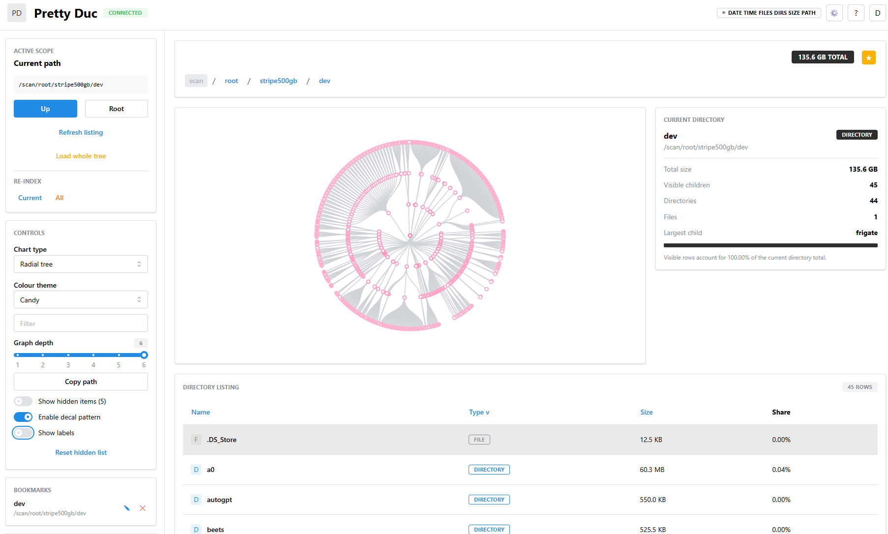

# Pretty Duc

[](https://hub.docker.com/r/sergejpopov/pretty-duc)
[](https://hub.docker.com/r/sergejpopov/pretty-duc)

Web UI for exploring disk usage. Point it at a [Duc](https://github.com/zevv/duc) database and browse with treemaps, sunbursts, flame graphs, filterable tables, and keyboard-driven navigation.

This project was built entirely with AI tools: 
* OpenCode + GPT 5.4
* Gemini CLI + 3.1 Pro
* OpenCode + Ollama Cloud + Minimax M2.7
* OpenCode Go + DeepSeek V4 Pro

## Screenshots

<p align="center">
  
  
  
</p>

## Quick start

```yml
# compose.yml
services:
  duc:
    image: mkoestler/duc-service
    restart: unless-stopped
    environment:
      SCHEDULE: "0 3 * * *"
    volumes:
      - /:/scan/root:ro
      - duc_database:/database

  pretty-duc:
    build:
      context: ..
    restart: unless-stopped
    ports:
      - "8081:3000"
    environment:
      DUC_DATABASE: /database/duc.db
      DUC_ROOT: /scan/root
      PORT: 3000
    volumes:
      - duc_database:/database:ro

volumes:
  duc_database:
```

```sh
sudo docker compose up -d
```

Open `http://localhost:3000`.

## What you can do

- **Browse** — navigate directories via breadcrumbs, the directory table, or by clicking chart segments. Keyboard shortcuts: Arrow keys to move, Enter to drill in, Backspace to go up.
- **Visualize** — 6 chart types: treemap, sunburst, flame graph, circle packing, tree, and radial tree. 11 color themes. Toggle labels, decal patterns, and depth levels.
- **Filter** — type to filter the current directory by name. Arrow keys to pick suggestions, Enter to drill into a directory from the dropdown.
- **Bookmark** — star a directory from the breadcrumb bar or right-click context menu. Bookmarks persist across sessions with editable labels.
- **Hide items** — right-click any item to hide it from charts and the table. Reset hidden items from the controls panel.

## Environment variables

| Variable | Default | Purpose |
| --- | --- | --- |
| `DUC_DATABASE` | `/database/duc.db` | Path to Duc database |
| `DUC_ROOT` | `/scan/root` | Root path scanned by Duc |
| `PORT` | `3000` | HTTP server port |
| `DUC_BIN` | `duc` | Duc binary path |
| `DUC_MOCK_ROOT` | unset | Fixture root for mock mode |
| `DEFAULT_MIN_SIZE` | unset | Min file size filter in bytes |
| `ENABLE_TREE_API` | `false` | Enables `/api/tree` endpoint |
| `CONFIG_FILE` | `pretty-duc-config.json` | Path to runtime config file |

## Docker

```bash
docker compose -f docker/compose.example.yml up --build
```

This starts a Duc scanner container and the Pretty Duc UI/API service. Only the scanner needs host filesystem access. Pretty Duc mounts the database read-only.

## Local development

```bash
bun install
bun run build
bun run test
```

Run API and web app separately:

```bash
bun run dev:api     # API at http://localhost:3000
bun run dev:web     # UI at http://localhost:5173 (proxies /api)
```

### Mock mode

No Duc binary or database needed:

```bash
bun run dev:mock    # API at :3001, UI at :5173
```

Uses `tests/fixtures/mock-scan-root` — a deterministic filesystem structure with nested directories for testing and development.

## API

### `GET /api/health`
Service and database status.

### `GET /api/info`
Raw `duc info` output with parsed metadata.

### `GET /api/children?path=/scan/root&levels=2&sort=sizeDesc`
Primary browsing endpoint. Returns directory children, supports recursive expansion (up to 6 levels), size filtering (`minSize`), and sorting (`sizeDesc` / `nameAsc`).

### `GET /api/tree?path=/scan/root/var&levels=2`
Subtree endpoint. Disabled by default (enable with `ENABLE_TREE_API`).

## Integration tests

```bash
bun run test:integration
```

Spins up Docker containers: a scanner indexing `tests/fixtures/fs`, Pretty Duc against that volume, and a test runner making black-box API assertions.

## Troubleshooting

**"Response likely exceeds configured payload budget" (413)**
Your scan produces too many nodes for the response limit. Increase `maxChildrenResponseBytes` or `maxRecursiveNodes` in your config file. Reduce `depth` in the UI to load fewer levels at once.

**"Path was not found in Duc index" (404)**
The directory exists on disk but hasn't been indexed. Re-run the Duc scanner or try a parent directory.

**"Cannot navigate above root directory"**
You're trying to browse above `DUC_ROOT`. All paths are restricted to the configured scan root.

## Credits

Built on top of these projects:

- [Duc](https://github.com/zevv/duc) — disk usage CLI
- [React](https://react.dev) + [Mantine](https://mantine.dev) — UI framework and component library
- [Apache ECharts](https://echarts.apache.org) — charting engine (treemap, sunburst, tree, custom renders)
- [Fastify](https://fastify.dev) — HTTP server and API framework
- [Vite](https://vite.dev) — frontend build tooling
- [Bun](https://bun.sh) — JavaScript runtime, bundler, and test runner
- [Zod](https://zod.dev) — schema validation and type inference
